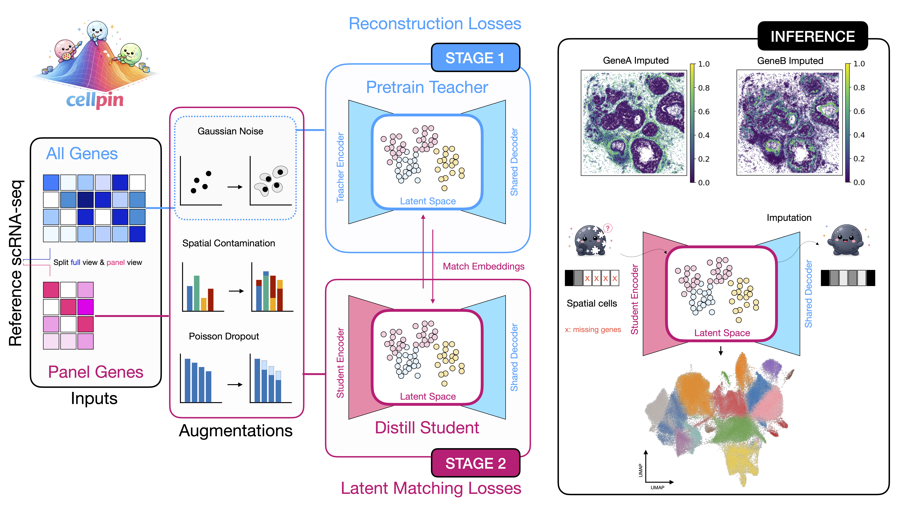

<p align="center">
  
</p>

# cellpin

[](https://cellpin.readthedocs.io)

cellpin is a lightweight probabilistic model that reconstructs and denoises spatial transcriptomes from single-cell RNA-seq references. It enables transcriptome-wide imputation, robust atlas-to-spatial label-transfer, and improved biological interpretation of both targeted-panel and full-transcriptome spatial datasets.
Read the documentation for detailed tutorials. 
## Quickstart

```python
import cellpin
from torch.utils.data import DataLoader

sc_ds, st_ds = cellpin.pp.setup_data(sc_adata, st_adata)
model = cellpin.CellPin(sc_ds)
model.fit(sc_ds)

loader = DataLoader(st_ds, batch_size=256, shuffle=False)
adata_out = model.impute(loader, obs_adata=st_adata)
```

## Installation

**pip**

```bash
pip install cellpin
```

**uv**

```bash
uv pip install cellpin
```

For SpatialData support add the spatial extras:

```bash
pip install "cellpin[spatial]"
# or
uv pip install "cellpin[spatial]"
```

## Documentation

Full documentation, tutorials, and API reference: [cellpin.readthedocs.io](https://cellpin.readthedocs.io/)

## Citation

If you use cellpin in your research, please cite:

> Putze P\*, Lucarelli D\*, Wellappili D, Bahrami M, Luecken MD, Theis FJ, Saur D.
> **Cellpin enables reference-based imputation and denoising of spatial transcriptomes.**
> *bioRxiv* 2026.06.02.729566.
> doi: [10.64898/2026.06.02.729566](https://doi.org/10.64898/2026.06.02.729566)
>
> \* Shared first authorship

```bibtex
@article{putze2026cellpin,
  title   = {Cellpin enables reference-based imputation and denoising of spatial transcriptomes},
  author  = {Putze, Philipp and Lucarelli, Daniele and Wellappili, Deelaka and Bahrami, Mojtaba and Luecken, Malte D. and Theis, Fabian J. and Saur, Dieter},
  journal = {bioRxiv},
  year    = {2026},
  doi     = {10.64898/2026.06.02.729566},
  url     = {https://doi.org/10.64898/2026.06.02.729566}
}
```

## Reproducibility
To reproduce findings of the manuscript please see: https://github.com/Saur-Lab/cellpin_manuscript_reproducibility


